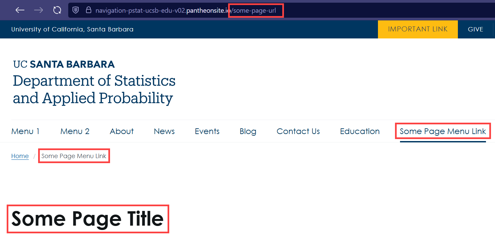
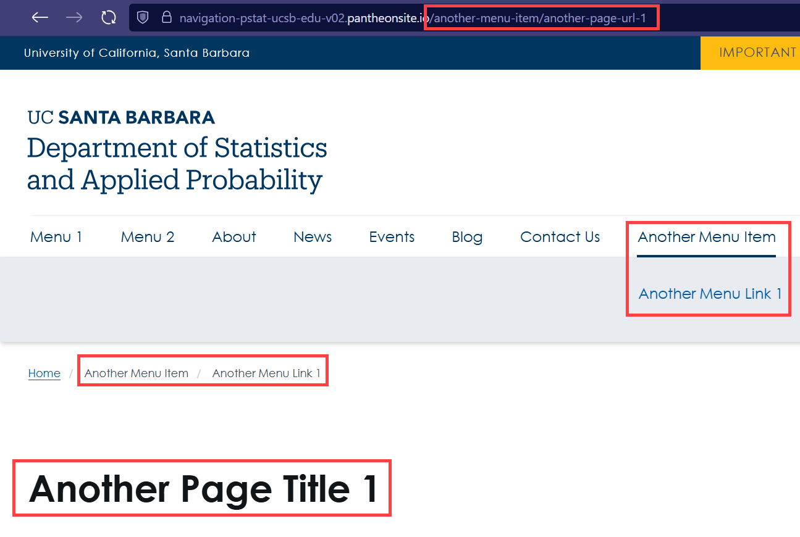
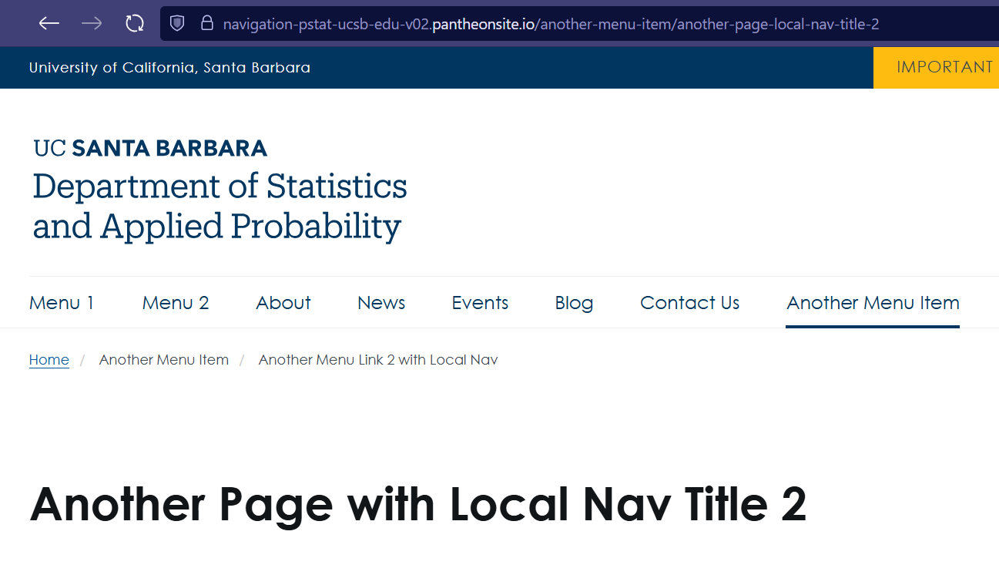
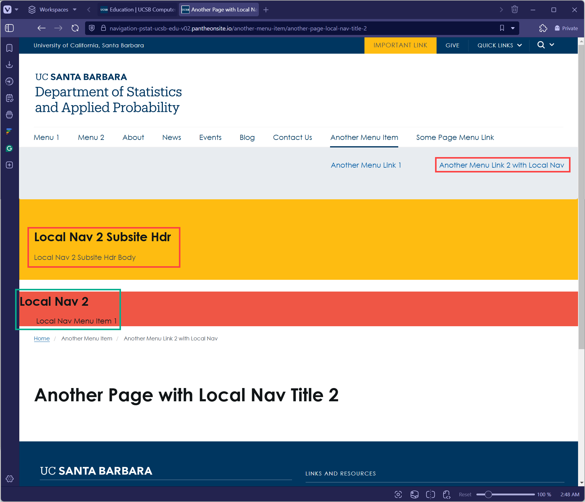

#drupal #website #pstat-homepage #navigation #menu

# Creating Top-level Menu Item
## Menu Item without Children Pages
The following process will create a 1st-level page with an associated menu item
1.  Content > Add Content > (Choose a Page Type) e.g., Basic Page
	1. Enter "Title": Some Page Title
	2. "MENU SETTINGS"
		- "Provide a menu link": Checked
		- "Menu link title": Some Page Menu Link
		- "Parent link": \<Main navigation\>
	3. "URL ALIAS"
		- "Generate automatic URL alias": Unchecked
		- "URL alias": /some-page-url
2. View result:  
## Menu Item with Children Pages
1. Create a menu item
   Structure > Menus > Main navigation > Edit menu > Add link
	1. "Menu link title": Another Menu Item
	2. "Link": \<nolink\>
2. Create a page that will be a child page (2nd-level page)
   Content > Add Content > (Choose a Page Type) e.g., Basic Page
	1. "Title": Another Page Title 1
	2. "MENU SETTINGS"
		- "Provide a menu link": Checked
		- "Menu link title": Another Menu Link 1
		- "Parent link": Another Menu Item
	3. "URL ALIAS"
		- "Generate automatic URL alias": Unchecked
		- "URL alias": /another-menu-item/another-page-url-1
		- Automatic URL alias is generated after initial save (/another-menu-item/another-page-title-1), and can be seen/edited after that
3. View result: 

# Adding a Local Navigation Menu
Local navigation menu is a menu on a 2nd-level page. This is a way to navigate to a 3rd-level page

Let's add a local navigation menu to the following 2nd-level page

1. Add a subsite header
	- Content > "Blocks" tab > Add content block > Subsite header
	  "Block description": Local Nav 2 Subsite Hdr
	  "Background color": yellow
	  "Secondary navigation background color": red
	  "Body": Local Nav 2 Subsite Hdr Body
2. Add a menu
	- Structure > Add menu
	  "Title": Local Nav 2
	  "Add link": {
		  Menu Link Title: Local Nav Menu Item 1,
		  Link: \<nolink\>
	  }
3. Block layout
	- Structure > Block layout > Secondary navigation > Place block
	  Search for "Local Nav 2 Subsite Hdr" > Place block
	  Automatically loads "Configure block" > Pages
	  Enter 
	  ```
		/another-menu-item/another-page-local-nav-title-2
		/another-menu-item/another-page-local-nav-title-2/*
		```
		Click "Save block"
	- Structure > Block layout > Secondary navigation > Place block
	  Search for "Local Nav 2" > Place block
	  Automatically loads "Configure block" > Pages
	  Enter 
		```
		/another-menu-item/another-page-local-nav-title-2
		/another-menu-item/another-page-local-nav-title-2/*
		```
		Click "Save block"
	- Structure > Block layout > Secondary navigation
	  Place "Local Nav 2 Subsite Hdr" first, then
	  Place "Local Nav 2"
	- "Save blocks"
4. View result: